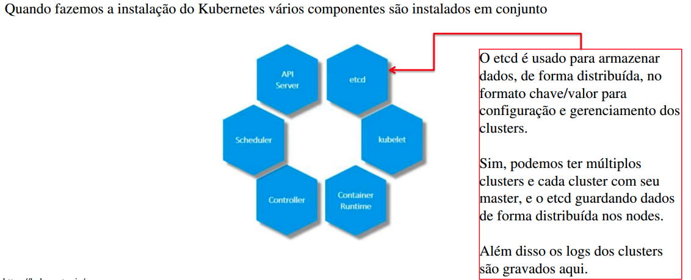

# Kubernetes  
Este arquivo foi criado pela professora Marianne Salomão, para revisão da aula.

## CONTAINERS

> Containers são uma maneira de criar ambientes isolados que podem executar código enquanto compartilham um único sistema operacional.

## DOCKER

> Gerenciar containers é uma tarefa difícil.

> O Docker é uma ferramenta que deixa a tarefa de gerenciar containers muito mais fácil.

## YAML - Yet Another Markup Language (Ainda outra linguagem de marcação)

> Essa linguagem faz parte do core do Docker, Kubernetes e tantas outras ferramentas.

# KUBERNETES

> Também é conhecido como K8s, foi criado pela Google, para resolverem os problemas de gerenciamento de containers em produção, ou seja, além do desenvolvimento de sistemas, quando o sistema está pronto e é publicado.

> Imagine que vc está desenvolvendo uma aplicação que possui estes containers:

- Nginx com Python;
- PostgreSQL;
- Redis;

> Vc terminou o desenvolvimento e publicou sua aplicação, com toda a ajuda e facilidade que o Docker e os containers proporcionam.

> Sua aplicação é um sucesso e vc precisa "escalar" para que os milhares de usuários tenham uma navegação tranquila.

> Como vc faria isso?

> Vc pode gerenciar isso manualmente, fazendo sua aplicação escalar up/down de acordo com as necessidades (Escalar UP: adicionar mais nodes ou containeres. Escalar DOWN: remover containeres ou nodes).

> Mas claro, sempre existe uma maneira mais inteligente de se fazer as coisas, vc pode usar essa inteligência de forma facilitada usando um orquestrador que faça esse processo.

> Entre os recursos, ele escala sua aplicação de forma automatizada, seja UP ou DOWN, sem vc ter que colocar a mão nisso. Vc criará as regras e depois disso vc não mexe em mais nada.

> Fazendo uso do kubernetes, a medida que sua aplicação vai recebendo mais acessos, novos "nodes" são criados, e se a aplicação tiver menos acessos, estes "nodes" extras são destruídos, fazendo com que se tenha mais flexibilidade. Ou seja, vc dificilmente perde sua Netflix.

> A imagem acima mostra os "nodes" da aplicação.

# Arquitetura do Kubernetes

> Para fazer uso do Kubernetes precisamos conhecer sua arquitetura básica, onde temos como componentes principais:

- Node

- Cluster

- Master

----

1. **NODE**: É uma máquina, física ou virtual, onde o Kubernetes está instalado. Se vc instalou o Kubernetes no seu computador, o seu PC é um Node.

> No Node criamos os containers (docker) com as nossas aplicações.

> Cada logo acima é um container, e o Kubernetes orquestrando eles.

----

2. **CLUSTER**: Um cluster é um conjunto de Nodes agrupados.

> vc instalou o Kubernetes nas suas máquinas, todas elas são um Node. O agrupamento delas, é um Cluster.

> E **porque** que é um Cluster?

> Porque todos esses nodes aí estão trabalhando em conjunto, é a mesma aplicação.

----

3. **MASTER**: A partir do momento que temos um cluster, alguém tem que ser responsável:

    1. Por gerenciá-lo;
    2. Para manter informações dos membros do cluster;
    3. Para monitorar os nodes;
    4. Para fazer algo (ativar um novo node ou não) quando um node falha;

> Essa é a função do **Master** (mestre), **e o mestre não é vc.**

> O mestre é um Node, o Node chefe. Um dos "caras" (nodes) do cluster, se torna o Master.

> O master é um Node que é o verdadeiro responsável pela orquestração dos containers.

> Os nodes que não são master, são chamados de **Worker Nodes**.

----

# Componentes do kubernetes

> Quando fazemos a instalação do Kubernetes, vários componentes são instalados em conjunto.

> Diferenças entre um Master Node e um Worker Node:

### Instalação

> Quando instalamos e configuramos o Kubernetes, teremos a disposição um programa de linha de comando chamado **kubectl** (Kube Control Tool) na qual se utiliza comandos do Kubernetes.

> Uma das utilizações desta ferramenta é para realizar deploy **(publicação)** de aplicações em um cluster do Kubernetes.

> Exemplos de comandos:

    kubectl run <nome da aplicacao>

    kubectl cluster-info

    kubectl get nodes

----

## Teste Rápido

1. O que são containers?
    - Containers são ambientes isolados para executar aplicações.

2. O que é Docker?
    - Docker é a empresa criadora da ferramenta Docker Engine, usada para facilitar o gerenciamento e uso dos containers.

3. o que é YAML?
    - É uma linguagem de marcação e serialização amplamente usada quando trabalhamos com docker, kubernetes e outras configurações.

4. O que é Kubernetes?
    - É um orquestrador de containers open-source, criado pela Google. É a ferramenta padrão do mercado atualmente.

5. Qual a finalidade de uso da API Server quando instalamos o Kubernetes?
    - A API Server tem como finalidade fornecer uma interface entre a instalação do Kubernetes e os usuários, dispositivos e acesso via linha de comando.

## PODS

> POD em Kubernetes é a menor unidade de computação publicável em um computador que podemos criar e gerenciar.

> Quando criamos uma aplicação em um container, o Kubernetes **não** faz uso/acesso direto ao container.

> Os containers são "encapsulados" em um objeto do Kubernetes chamado POD:

> Leia essa imagem assim: Tem um container aqui? Então ele tá dentro de um POD. Tem outro container aqui? Ele tá dentro de um POD e assim vai.

> Desta forma, em Kubernetes, um POD é uma instância única de uma aplicação.

> O Kubernetes faz acesso ao POD e não ao container. É no POD que as coisas acontecem.

> mas o que aconteceria se a sua aplicação fosse um sucesso e tivesse vários acessos? O que o Kubernetes faria para dividir a carga?

> Ele cria um novo POD com um container idêntico ao original para balancear o tráfego.

> Assim, temos agora duas instâncias da nossa aplicação rodando em dois diferentes PODs no mesmo node do cluster Kubernetes.

> Se a quantidade de acessos à sua aplicação continuar a crescer e seu Node não suportar novas instâncias da aplicação, ainda podemos adicionar quantos novos nodes forem necessários ao cluster para dividir a carga.

> O que são clusters? Não são vários Nodes?! Sim.

- Resumindo o ponto mais importante até aqui:

> Em Kubernetes, a relação POD/Container é 1:1

> Ou seja, para 1 container temos 1 POD.

> Para escalar **UP** sua aplicação, você cria um novo POD, que irá instanciar um container idêntico ao já existente, e para escalar **DOWN** vc deleta o POD.

> Ou seja, vc não adiciona diretamente um novo container para escalar sua aplicação, o POD irá fazer isso.

### PODS Multicontainer

> Sabemos que a relação POD/Container é 1:1, porém em alguns casos raros, podemos ter a necessidade de uma aplicação fazer uso de um container helper/auxiliar.

> Os containers se comunicam via "localhost" já que fazem parte da mesma rede, e podem inclusive acessar dados de armazenamento em conjunto.

### Alguns Comandos

    minikube start
> Esse comando cria um cluster

    kubectl run nginx --image nginx
> O Comando `kubectl` cria PODS no nosso cluster.

> O comando acima irá criar um POD chamado 'nginx' no nosso cluster (minikube start) Kubernetes com um container através da imagem formada via parâmetro.

    kubectl get pods
> Pra ver todos os PODS existentes no cluster. Status dos PODS

    kubectl get pods -o wide
> Informações

    kubectl describe pod <nomedopod>

## YAML

- **apiVersion**: Neste campo definimos a versão do objeto que estamos criando na API* do Kubernetes.

- **kind**: Define o tipo de objeto do Kubernetes que estamos criando.

- **metadata**: Metadados são dados pertencentes a determinado objeto, neste caso pertencem ao objeto que está sendo criado.

- **spec**: Este campo é referente as especificações do objeto Kubernete que está sendo criado.

> Com o arquivo kubernetes definido, podemos criar o objeto com o comando:

    kubectl create -f <nome-do-arquivo-yaml>

> Exemplo de arquivo .yaml

    apiVersion: v1
    kind: Pod
    metadata:
      name: nginx
      labels:
        app: nginx
        tier: frontend
    spec:
      containers:
        - name: nginx
          image: nginx

# REPLICATION CONTROLLER E REPLICASETS

> Na arquitetura e componentes do Kubernetes vimos que o Controller Manager é o "cérebro" por traz de toda a automação do Kubernetes.

> Esse componente monitora os objetos presentes no cluster e age de acordo com as necessidades.

> Uma das ferramentas que fazem parte do Controller Manager é o **Replication Controller**.

> Para entender o que é uma **replica**, vamos imaginar o seguinte cenário: Imagine que vc tenha desenvolvido uma aplicação e publicou ela em um cluster contendo 1 pod/container.

> Mas aí seu POD falhou. Se o seu pod falhou, sua aplicação caiu e os usuários não conseguem mais acessar.

> O ideal é ter no MÍNIMO dois pods na aplicação.

> **É aqui que entra o Replication Controller, que nos ajuda a executar múltiplas instâncias de um pod/container no nosso cluster Kubernetes. Ele faz isso replicando (duplicando) o POD container existente, fazendo com que tenhamos uma cópia exata.**

> Isso provê para nossa aplicação **Alta Disponibilidade!**.

> Isso significa que o Replication Controller só nos ajuda se tivermos múltiplas instâncias do pod/container sendo executadas?

> Ou seja, se nossa aplicação estiver sendo executada em um único POD/CONTAINER não podemos usar o Replication Controller? **Podemos Sim!**

> Se vc estiver fazendo uso do Replication Controller, mesmo que vc só tenha um único pod na sua aplicação, se o seu pod falhar, uma réplica do pod é criada automaticamente.

- O que o Replication Controller faz é se certificar que o número especificado de pods do cluster estejam sempre sendo executados.

- Não importa se temos um cluster com 1 pod ou com 1000 pods.

> Sempre vão estar sendo executados a quantidade de pods que foi especificado!

### Balanceamento de Carga e Escalamento (scaling) da aplicação

